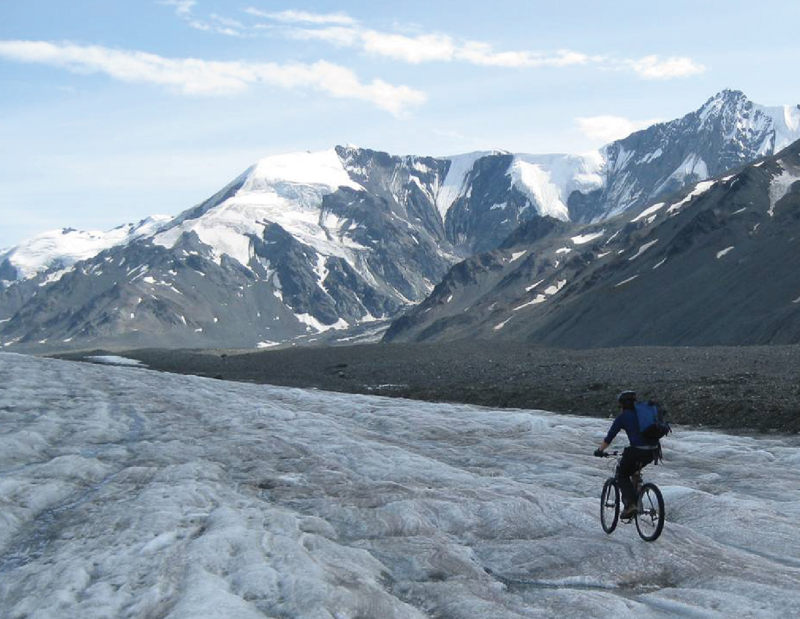

During my undergraduate at the University of Alaska Fairbanks, I participated in a summer Field Glaciology course. While we focused on traditional bare-ice glaciological methods, I was fixated on how the measurements we were making were not representative of the neighboring ice covered by rocks. When I learned that that debris-covered portions of glaciers were often treated like bare glacier ice in most studies, I wrote a student research proposal to investigate this on my own. 

In the infancy of the program, supplies and trips relied on self-funding, I was loaned expensive sensors by professors who didn't have any real reason to trust me (notably [Anthony Arendt](http://apl.uw.edu/people/profile.php?last_name=Arendt&first_name=Anthony) and [Jeff Freymueller](http://gps.alaska.edu/jeff/)), science gear was ferried to the glacier by bicycle, many trips were done solo and a lot of challenges were met, like the classic failed steam drilling attempt through debris-covered ice. Applying for and receiving several competitive student grants allowed me to purchase a [Kovacs ice drill](https://kovacsicedrillingequipment.com/mechanical-drilling/), charter Super Cubs and [helicopters](https://aklandex.com/), purchase sensors and build two weather stations from scratch. I have learned a lot since 2011 and have managed to keep a steady flow of data on a near annual basis with each successive field campaign expanding in scope. The first publication to use Canwell Glacier data was published in May 2018 and several more, digging deeper into the data archive, are in preparation.

## Press ##

[2016 Anchorage Daily News article by Ned Rozell](https://www.adn.com/alaska-news/science/2016/09/17/meet-the-man-studying-alaskas-glaciers-by-living-on-one-for-a-few-days-at-a-time-each-summer/)

[2014 poster presentation to members of the US Congress in Washington DC](https://uaf.edu/ursa/spotlight/)

## Past funding ##

- 2016: Northumbria University PhD fieldwork funding
- 2013 - 2014: Undergraduate Research & Scholarly Activity (URSA) research grant. "Developing a multi-method approach to improve regional-scale glacier melt estimates by considering debris cover"
- 2012: University of Alaska Fairbanks [Technology Advisory Board (TAB)](https://www.uaf.edu/uafgov/files/staff-council/meetings/fy12/sc227/Attachment_227_2_TAB_Committee_Report_April_2012.pdf)  equipment grant. “Thermal camera for student use.”
- 2011 - 2012: University of Alaska Fairbanks Undergraduate Research & Scholarly Activity (URSA) research grant. "Differential melt of debris-covered glaciers in the Alaska Range."
- 2010 - 2012: University of Alaska Fairbanks [Center for Global Change](http://www.cgc.uaf.edu/student_grant/awardees-2010.htm) research grant. "Effects of debris cover on glaciers in Alaska"