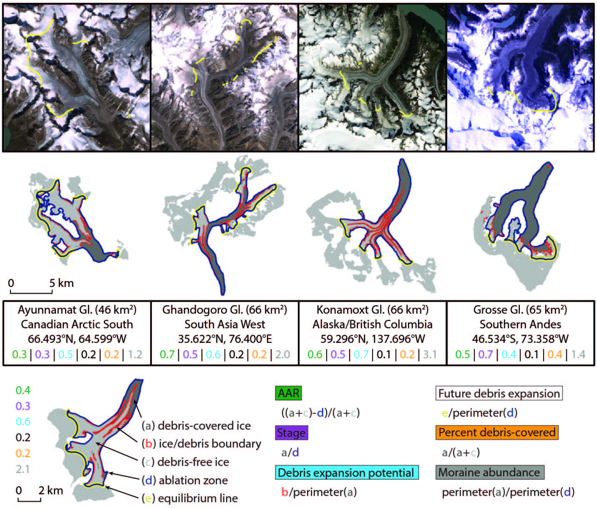

"1° x 1° cells over glacierized area showing percent debris-covered area."

In order to derive a global debris cover map at an operative quality, the Randolph Glacier Inventory Version 6.0 needed to be corrected and updated. Because I was the sole glaciologist to manually correct this dataset, there is now a heightened level of consistency that has never before been present in a global glacier dataset. 

With a high confidence map of glacier area and debris cover, an equilibrium line estimate can be made for glaciers with sufficient debris cover. 

After the derivation of each galcier's equilibrium line, the accumulation area ratio (AAR), a metrics of glacier health, can be calculated. 

From here I was able to diverge from the common, and not-so-informative, metric " percent debris-covered"  to define four new metrics, that, together, describe the state and geometric configuration of each glacier's debris cover. These new metrics are defined below with examples from around the world.

The updated RGI, debris maps and per-glacier metric values are all available for all glacierized regions on Earth [here](https://doi.org/10.5281/zenodo.3866466).

