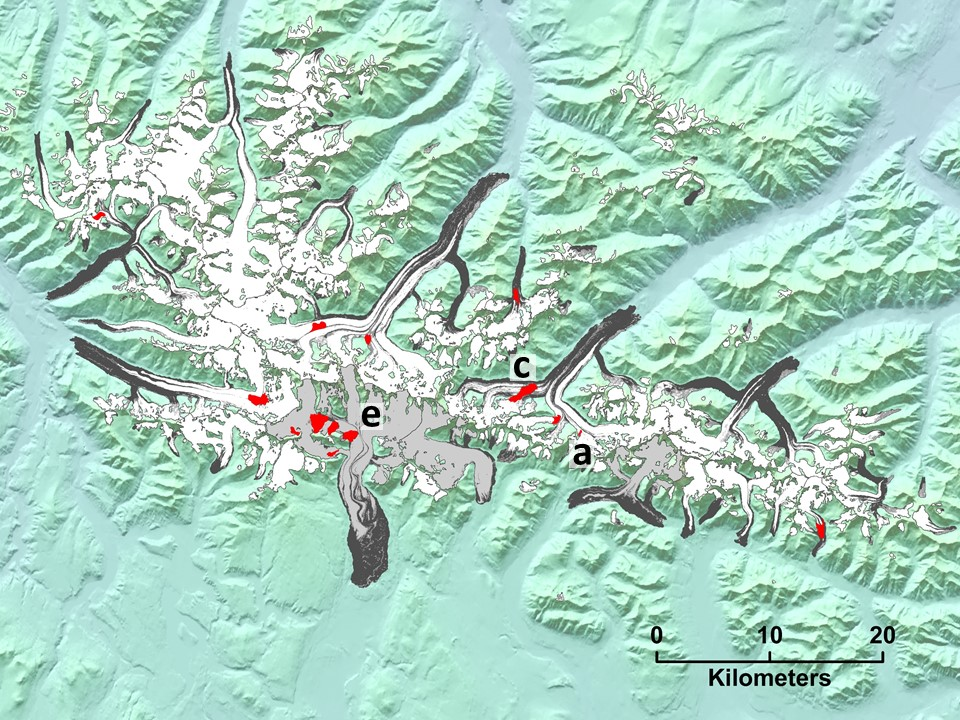
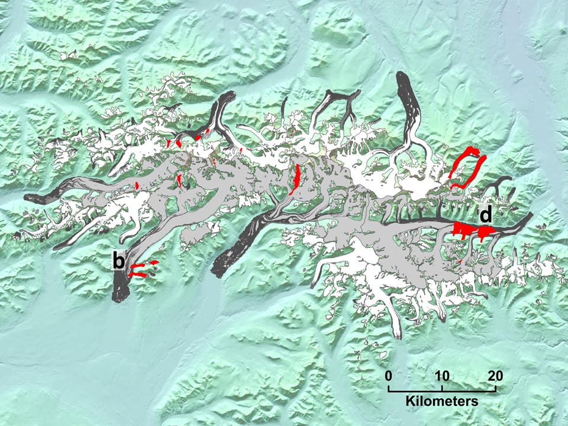
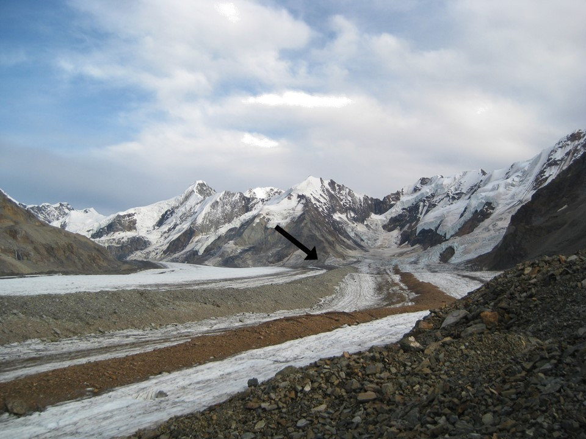
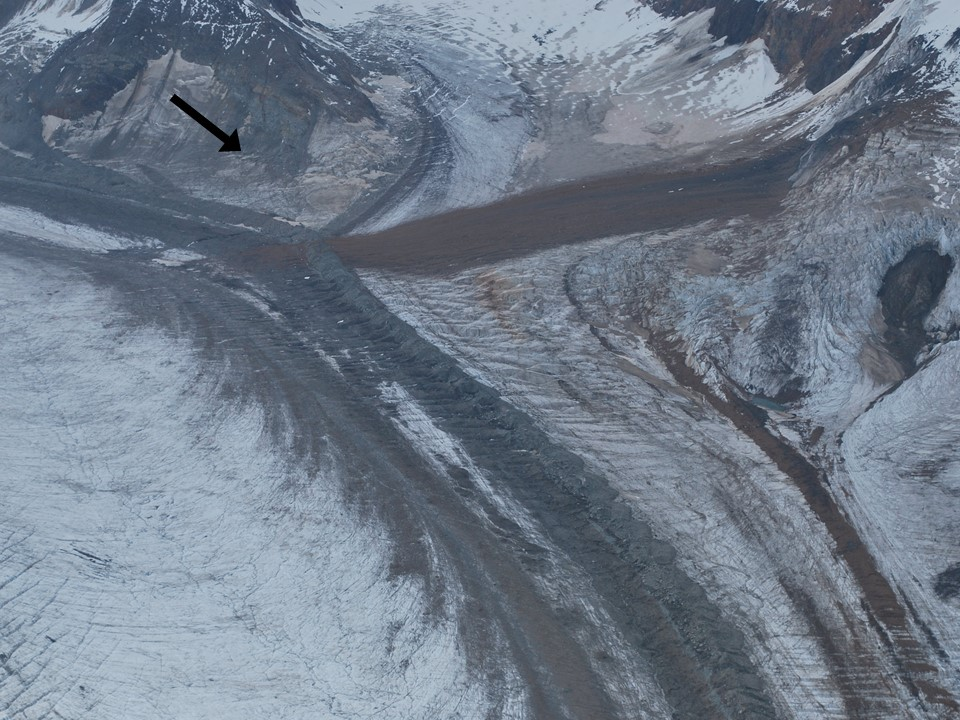
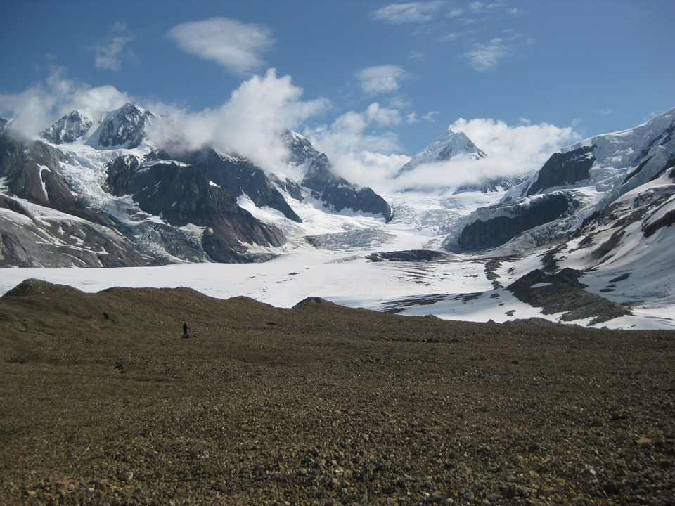
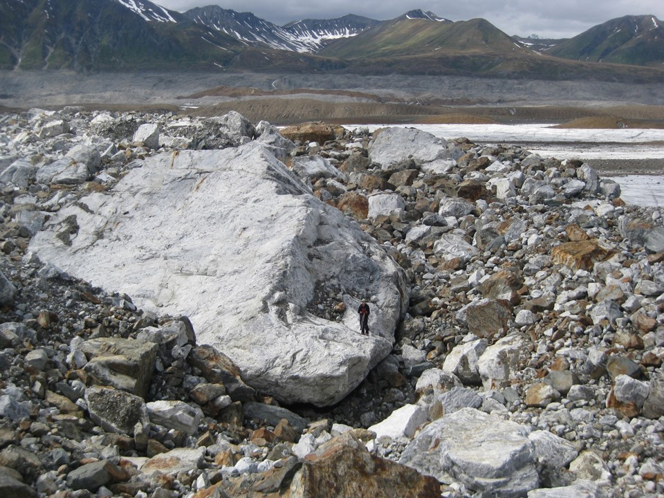
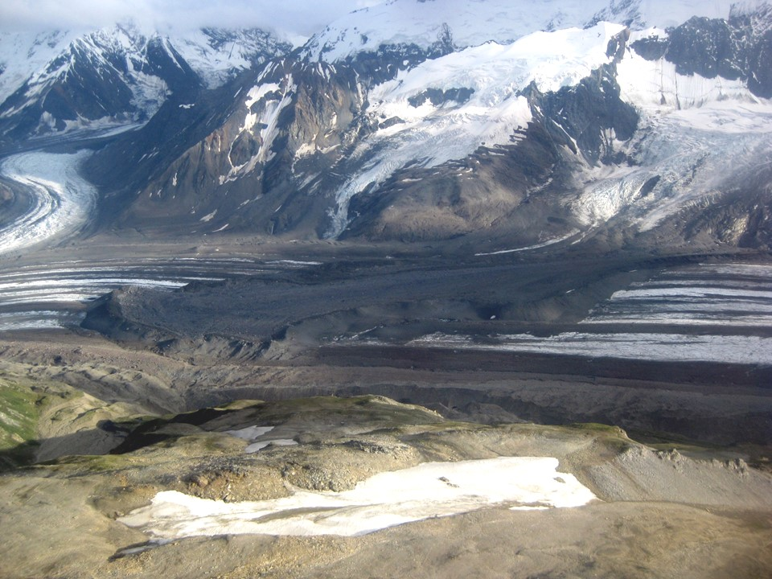
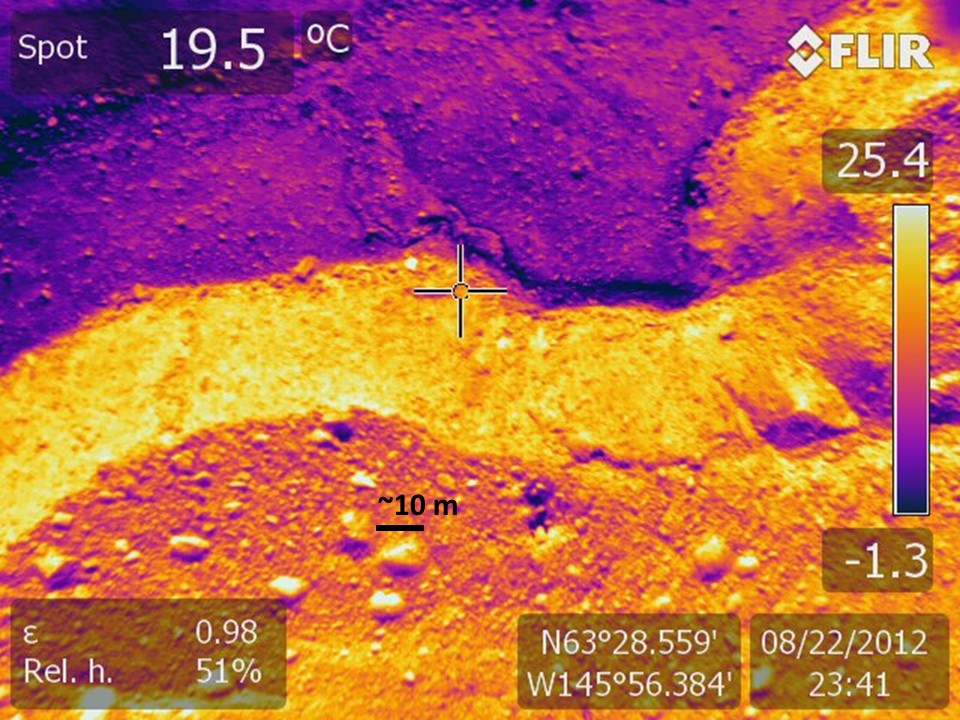
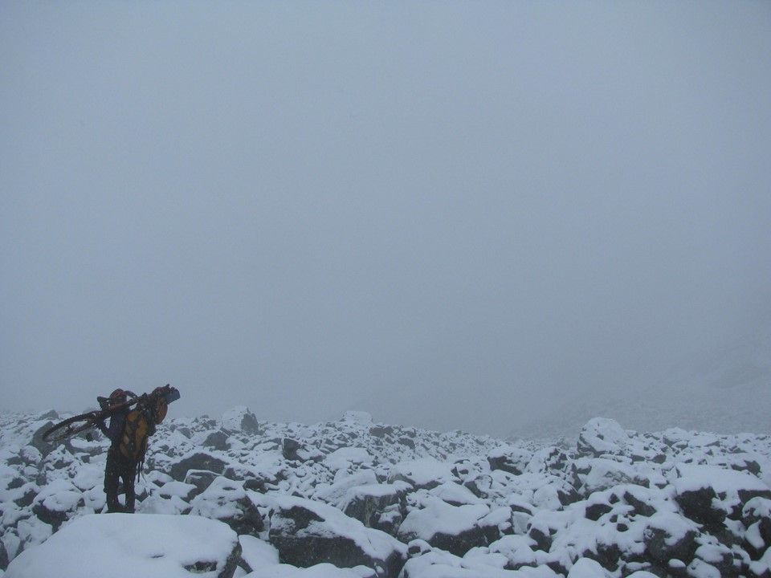

Landslides, more technically rock avalanches, are striking features when deposited onto glaciers. Since 2010 I have been both scientifically and personally interested in visiting as many as I can while also keeping an eye on satellite imagery for the next big one... They are all quite unique, as you will see from some of my favorites shown below. 

The Delta Mountains, a sub-range of the Alaska Range. Landslides are shown in red and letters correspond to the locations of the images below. 

The Hayes Range, a sub-range of the Alaska Range. Landslides are shown in red and letters correspond to the locations of the images below. 

**(a)** In 2010, Andy Sterns and I camped for two weeks on the West Fork Robertson Glacier. Our tent was on the medial moraine just below the arrow.

**(a)** When we returned to the same spot in 2011 a fresh landslide had been deposited almost exactly where our camp was the previous year. The arrows point to the same location in both images. Notice how the debris "jumped" over the medial moraine! Glaciers, and the rock debris on top of them, are in constant state of flux. 

**(a)** Investigating the debris from the landslide shown above. Andy Sterns for scale. Notice the rock size and size distribution: small and uniform.

**(b)** In contrast to the image above. Investigating landslide debris on the West Fork Glacier (Hayes Range). Andy Sterns for scale, standing on a house sized rock.     

**(c)** West Fork Roberson Glacier, landslide deposition ~1981. Notice the ridge along the perimeter of the landslide, this is common but not always present. 

**(d)** Downward-looking thermal image captured during a flight with [Martin Truffer](http://glacieradventures.blogspot.com/) over Black Rapids Glacier. Several landslides on Black Rapids Glacier, along with many others all arcoss the Alaska Range, were deposited during the 2002 Denali Fault earthquake. Notice the shading effect on surface temperature from the giant boulders and the "cold" spots on the meters thick debris cover. 

**(e)** One of the several landslides deposited onto Gakona Glacier in 2002. Maybe it goes without saying, but the winter biking here turns out to be awful.

