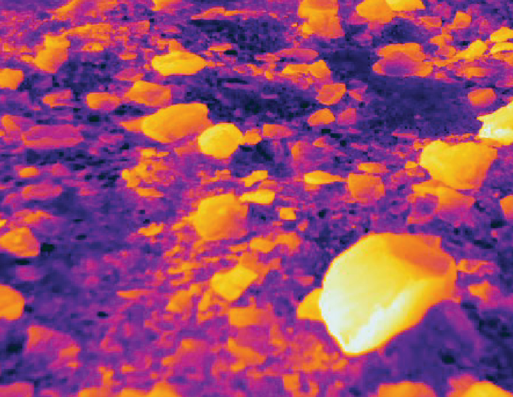

The thermal image below is of fist to silt-sized clasts on an otherwise bare glacier ice surface. This entire image falls within one or two pixels in the above thermal image which is looking straight down from a helicopter with an image width of several hundred meters. High resolution thermal data holds many answers about debris cover but has received limited attention from glaciologists. The 2021 paper referenced below details some uses of thermal data in glaciology.

