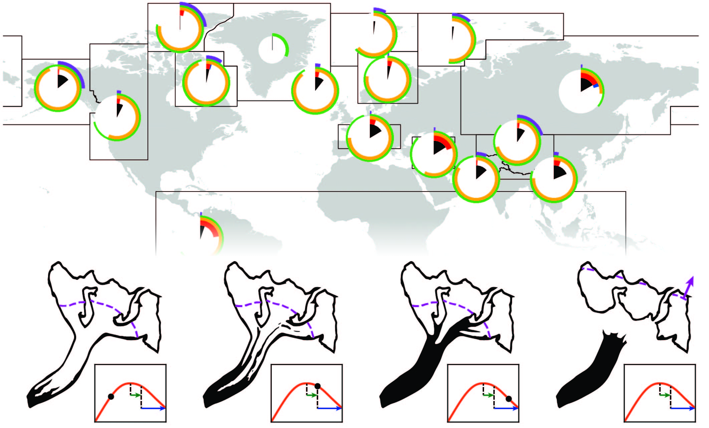

{}
A summary of this paper written in accessable language for the Nature Sustainability Community "Behind the Paper" series is available [here](https://sustainabilitycommunity.springernature.com/posts/rocks-catching-a-ride-out-of-the-mountains-on-a-glacier-might-be-keeping-sea-level-rise-a-little-lower-than-expected).
{}

The state and evolution trajectory of Earth's glaciers.    

 
  

 
  
## **Press for 'The State Of'**

 

**Phys.org** [Blanket of rock debris offers glaciers more protection from climate change than previously known](https://phys.org/news/2020-08-blanket-debris-glaciers-climate-previously.html)  
**Jungfrau Zeitung** (Switzerland) [Hälfte der Gletscher weltweit mit Schutt bedeckt](https://www.jungfrauzeitung.ch/artikel/183790/) (Language: DE)  
**Tages Anzeiger** (Switzerland) [Wie Schutt die Gletscherschmelze beeinflusst](https://www.tagesanzeiger.ch/wie-schutt-die-gletscherschmelze-beeinflusst-968089837751) (Language: DE)  
**Der Standard** (Austria) [Herumliegender Schutt lässt Gletscher langsamer schmelzen](https://www.derstandard.de/story/2000119222428/herumliegender-schutt-laesst-gletscher-langsamer-schmelzen) (Language: DE)  
**El Mercurio** (Chile) [Una frazada para el glaciar](https://www.elmercurio.com/blogs/2020/08/10/81023/Una-frazada-para-el-glaciar.aspx) (Language: ES)   
**教育 新闻 网** [岩屑毯为冰川提供了更多的保护 使其免受气候变化的影响](https://www.edunews.net.cn/2020/kexue_0810/13702.html?fbclid=IwAR1ByE-emaxjmQq3nTNh0zx5IRm042uJ2Y0Bux2Kq2qCxF8tbyk6UpOM0y8) (Language: CMN)  
**Middle East business and financial news** [British-Swiss study reveals more glacier-shielding rock debris](https://menafn.com/1100596880/British-Swiss-study-reveals-more-glacier-shielding-rock-debris)  
**Kurier** [Hälfte der Gletscher weltweit mit Schutt bedeckt](https://kurier.at/wissen/wissenschaft/haelfte-der-gletscher-weltweit-mit-schutt-bedeckt/400993364) (Language: DE)  
**Népszava** [Kőtörmelék borítja a gleccsereket](https://nepszava.hu/3087502_kotormelek-boritja-a-gleccsereket) (Language: HU)  
**Hirado.hu** [A svájci Erdő, Hó- és Tájkutatási Szövetségi Intézet (WSL) első alkalommal vizsgálta meg műholdak segítségével, milyen mértékben fedi kőtörmelék a gleccsereket.](https://hirado.hu/tudomany-high-tech/cikk/2020/08/06/kotormelek-boritja-a-gleccserek-felet) (Language: HU)  
**ORIGO** [A gleccserek felét törmelék borítja](https://www.origo.hu/tudomany/20200809-a-gleccserek-felet-tormelek-boritja-vilagszerte.html) (Language: HU)  
**Eurasia Review** [Rock Debris Protects Glaciers From Climate Change More Than Previously Known](https://www.eurasiareview.com/07082020-rock-debris-protects-glaciers-from-climate-change-more-than-previously-known/)  
**Innovations Report** [Rock debris protects glaciers from climate change more than previously known](https://www.innovations-report.com/earth-sciences/rock-debris-protects-glaciers-from-climate-change-more-than-previously-known/)  
**AAAS EurekAlert!** [Rock debris protects glaciers from climate change more than previously known](https://www.eurekalert.org/news-releases/909763)  
**ScienceDaily** [Blanket of rock debris offers glaciers more protection from climate change than previously known](https://www.sciencedaily.com/releases/2020/08/200805110120.htm)  
**Swissinfo.ch** [British-Swiss study reveals more glacier-shielding rock debris](https://www.swissinfo.ch/eng/sci-tech/british-swiss-study-reveals-more-glacier-shielding-rock-debris/45951010)  
**WSL-Institut für Schnee- und Lawinenforschung SLF** [Eine Decke aus Gestein schützt Gletscher besser als vermutet vor dem Klimawandel](https://www.slf.ch/de/2020/08/eine-decke-aus-gestein-schuetzt-gletscher-besser-als-vermutet-vor-dem-klimawandel.html) (Language: DE)  
**science.orf.at** [Hälfte der Gletscher mit Schutt bedeckt](https://science.orf.at/stories/3201330/) (Language: DE)  
**Tierwelt** [Hälfte der Gletscher weltweit mit Schutt bedeckt](https://www.tierwelt.ch/news/natur-umwelt/haelfte-der-gletscher-weltweit-mit-schutt-bedeckt) (Language: DE)  
**Nau.ch** [Fast Hälfte der Gletscher weltweit mit Schutt bedeckt](https://www.nau.ch/news/forschung/fast-halfte-der-gletscher-weltweit-mit-schutt-bedeckt-65756555) (Language: DE)  
 
  

