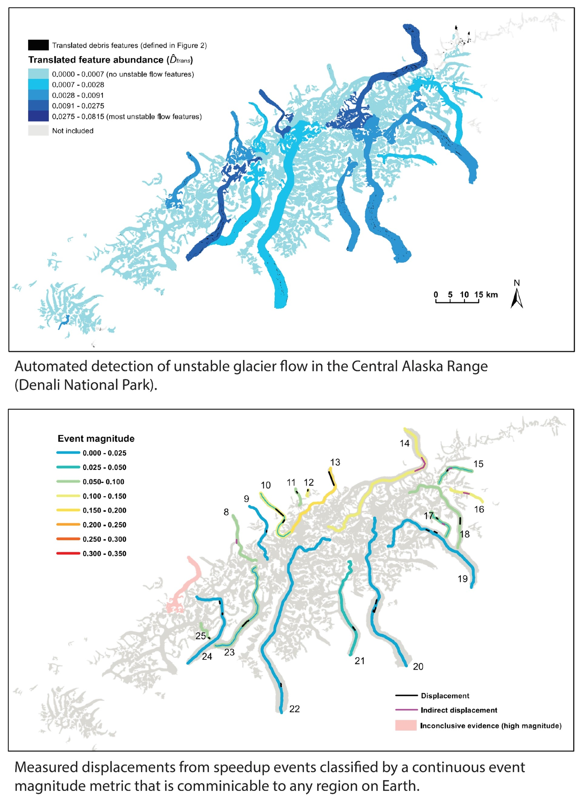

## **Press coverage for work on surging glaciers**  
 

**Washington Post** [An Alaska glacier hurtles downhill in a rare exhibition of ‘this amazing science’](https://www.washingtonpost.com/science/alaska-glacier-surge-muldrow-climate/2021/06/04/dade503a-c315-11eb-9a8d-f95d7724967c_story.html)  

