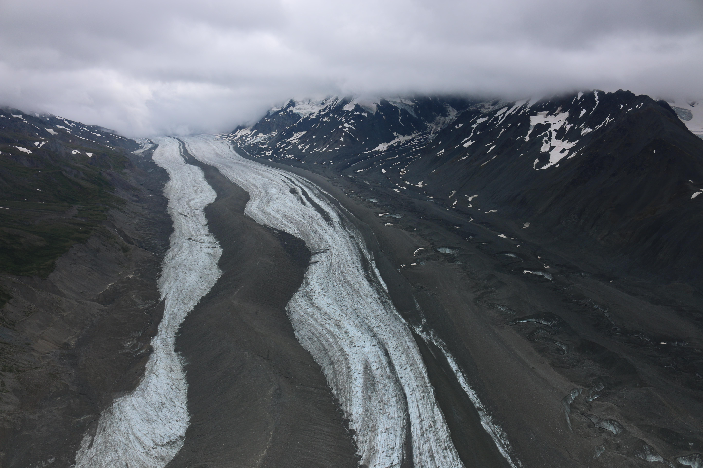

{}
A [5 post series](https://www.instagram.com/p/CW9SAC-llbg/) on my Instagram gives a summary of this paper in accessible language and tells the story about what it took to personally finance it.
{}

Oblique image of Canwell Glacier from the same helicopter flight used to capture the (straight downward-looking) images above (July 29th, 2016 11:00 AM local Alaska time).

 
  
## **Press for 'What can thermal'**

 

**Anchorage Daily News** [Meet the man studying Alaska's glaciers by living on one each summer](https://www.adn.com/alaska-news/science/2016/09/17/meet-the-man-studying-alaskas-glaciers-by-living-on-one-for-a-few-days-at-a-time-each-summer/)  
**Juneau Empire** [Alaska Science Forum: Living on a glacier, thinking about rocks](https://www.juneauempire.com/life/alaska-science-forum-living-on-a-glacier-thinking-about-rocks/) 

